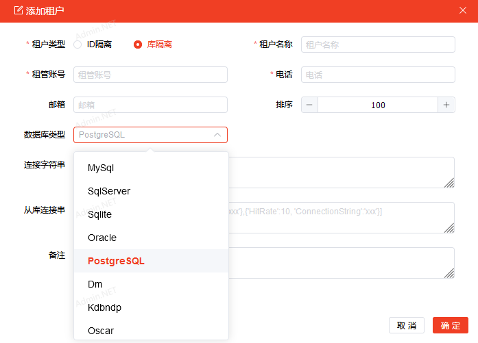

# 17. 多租户SAAS

:::tip 提示

Admin.NET 默认启用多租户模式，默认的主库其实就是一个默认租户。若不涉及租户数据管理，业务应用层可以忽略，完全不用理会这个租户及其逻辑处理。常见的多租户 SAAS 分库一般分两种情况，租户 Id 隔离和独立数据库隔离。Admin.NET 已经集成此两种模式，可以任意选择使用。
:::

## Admin.NET 多租户数据库设计

### 1、基础信息库

主要存组织架构 、权限、字典、用户等 公共信息

性能优化：因为基础信息库是共享的，所以我们可以使用 读写分离，或者二级缓存来进行性能上的优化

### 2、应用业务库

我们要进行的分库都基于业务库进行分库，例如：A 集团使用 A01 库，B 集团使用 B01 库，也可以多个小集团使用一个数据库，如下：

业务库1：集团A、VIP用户独享一个库

业务库2：集团B、 集团F

业务库3：集团C、集团D、集团E...... 集团Z，小客户多人共享一个库

性能无瓶颈可扩展：因为合理的进行了分库，所以在性能上并没有什么瓶颈，并且数据库可以扔到不同的服务器上

:::tip 提示

Admin.NET 针对多租户数据操作时，都做了封装操作，比如切换指定租户库时 `var db = iTenant.GetConnectionScope(config.ConfigId.ToString()); `直接根据租户Id切换即可。

推荐使用此方法进行租户库切换 `App.GetRequiredService<SysTenantService>().GetTenantDbConnectionScope(long.Parse(tenantId)); `, 类 `SysTenantService` 对租户列表有缓存处理，速度更快。

针对使用仓储操作数据库时，直接注入相应的业务实体仓储即可，和普通数据库仓储没嘛区别，框架针对租户仓储进行了封装处理，自动进行租户库切换，业务应用层无感。
:::

```csharp
namespace Admin.NET.Core;

/// <summary>
/// SqlSugar 实体仓储
/// </summary>
/// <typeparam name="T"></typeparam>
public class SqlSugarRepository<T> : SimpleClient<T>, ISqlSugarRepository<T> where T : class, new()
{
    public SqlSugarRepository()
    {
        var iTenant = SqlSugarSetup.ITenant; // App.GetRequiredService<ISqlSugarClient>().AsTenant();
        base.Context = iTenant.GetConnectionScope(SqlSugarConst.MainConfigId);

        // 若实体贴有多库特性，则返回指定库连接
        if (typeof(T).IsDefined(typeof(TenantAttribute), false))
        {
            base.Context = iTenant.GetConnectionScopeWithAttr<T>();
            return;
        }

        // 若实体贴有日志表特性，则返回日志库连接
        if (typeof(T).IsDefined(typeof(LogTableAttribute), false))
        {
            if (iTenant.IsAnyConnection(SqlSugarConst.LogConfigId))
                base.Context = iTenant.GetConnectionScope(SqlSugarConst.LogConfigId);
            return;
        }

        // 若实体贴有系统表特性，则返回默认库连接
        if (typeof(T).IsDefined(typeof(SysTableAttribute), false))
            return;

        // 若未贴任何表特性或当前未登录或是默认租户Id，则返回默认库连接
        var tenantId = App.User?.FindFirst(ClaimConst.TenantId)?.Value;
        if (string.IsNullOrWhiteSpace(tenantId) || tenantId == SqlSugarConst.MainConfigId) return;

        // 根据租户Id切换库连接, 为空则返回默认库连接
        var sqlSugarScopeProviderTenant = App.GetRequiredService<SysTenantService>().GetTenantDbConnectionScope(long.Parse(tenantId));
        if (sqlSugarScopeProviderTenant == null) return;
        base.Context = sqlSugarScopeProviderTenant;
    }
}
```

在菜单【平台管理】-【租户管理】页面创建租户，以租户 Id 和数据库隔离两种模式自行选择。



租户 Id 数据隔离模式就一个当前默认数据库，各租户数据都已租户 Id 进行过滤隔离。

数据库隔离模式支持常见的数据库种类，注意一定要输入正确的数据库连接字符串。创建租户库的时候，会自动生成一个租户管理员，给租户管理员分配菜单和接口资源权限，然后该租户管理员给自己租户内可以任意创建自己的租户账号、租户组织结构、租户角色、租户职位等等，这样各个租户权限和数据都是库隔离的。`注意所有的租户账号都不能相同，因为租户账号都存在了主库账号表里面。因为账号表本身具有租户 Id 字段，理论上可以实现各租户账号允许相同的存在，但是这样一样登录的时候得指定租户或者以二级域名来区分了，可自行修改。`

下面时创建租户数据库逻辑代码，租户数据库里面只有业务应用实体表，没有账号、权限等平台数据表。

```csharp
    /// <summary>
    /// 初始化租户业务数据库
    /// </summary>
    /// <param name="iTenant"></param>
    /// <param name="config"></param>
    public static void InitTenantDatabase(ITenant iTenant, DbConnectionConfig config)
    {
        SetDbConfig(config);

        if (!iTenant.IsAnyConnection(config.ConfigId.ToString()))
            iTenant.AddConnection(config);
        var db = iTenant.GetConnectionScope(config.ConfigId.ToString());
        db.DbMaintenance.CreateDatabase();

        // 初始化租户库表结构-获取所有业务应用表（排除系统表、日志表、特定库表）
        var entityTypes = App.EffectiveTypes.Where(u => !u.IsInterface && !u.IsAbstract && u.IsClass && u.IsDefined(typeof(SugarTable), false) &&
            !u.IsDefined(typeof(SysTableAttribute), false) && !u.IsDefined(typeof(LogTableAttribute), false) && !u.IsDefined(typeof(TenantAttribute), false)).ToList();
        if (!entityTypes.Any()) return;

        foreach (var entityType in entityTypes)
        {
            var splitTable = entityType.GetCustomAttribute<SplitTableAttribute>();
            if (splitTable == null)
                db.CodeFirst.InitTables(entityType);
            else
                db.CodeFirst.SplitTables().InitTables(entityType);
        }

        // 初始化业务应用种子数据
        var seedDataTypes = App.EffectiveTypes.Where(u => !u.IsInterface && !u.IsAbstract && u.IsClass && u.GetInterfaces().Any(i => i.HasImplementedRawGeneric(typeof(ISqlSugarEntitySeedData<>))))
            .Where(u => u.IsDefined(typeof(AppSeedAttribute), false)).ToList();

        foreach (var seedType in seedDataTypes)
        {
            var instance = Activator.CreateInstance(seedType);
            var hasDataMethod = seedType.GetMethod("HasData");
            var seedData = ((IEnumerable)hasDataMethod?.Invoke(instance, null))?.Cast<object>().ToList();
            if (seedData == null) continue;

            var entityType = seedType.GetInterfaces().First().GetGenericArguments().First();
            var entityInfo = db.EntityMaintenance.GetEntityInfo(entityType);
            var dbConfigId = config.ConfigId.ToLong();
            // 若实体包含租户Id字段，则设置为当前租户Id
            if (entityInfo.Columns.Any(u => u.PropertyName == nameof(EntityTenantId.TenantId)))
            {
                foreach (var sd in seedData)
                {
                    sd.GetType().GetProperty(nameof(EntityTenantId.TenantId)).SetValue(sd, dbConfigId);
                }
            }
            // 若实体包含Pid字段，则设置为当前租户Id
            if (entityInfo.Columns.Any(u => u.PropertyName == nameof(SysOrg.Pid)))
            {
                foreach (var sd in seedData)
                {
                    sd.GetType().GetProperty(nameof(SysOrg.Pid)).SetValue(sd, dbConfigId);
                }
            }
            // 若实体包含Id字段，则设置为当前租户Id递增1
            if (entityInfo.Columns.Any(u => u.PropertyName == nameof(EntityBaseId.Id)))
            {
                foreach (var sd in seedData)
                {
                    sd.GetType().GetProperty(nameof(EntityBaseId.Id)).SetValue(sd, ++dbConfigId);
                }
            }

            // 若实体是系统内置，则切换至默认库
            if (entityType.GetCustomAttribute<SysTableAttribute>() != null)
                db = iTenant.GetConnectionScope(SqlSugarConst.MainConfigId);

            if (entityInfo.Columns.Any(u => u.IsPrimarykey))
            {
                // 按主键进行批量增加和更新
                var storage = db.StorageableByObject(seedData).ToStorage();
                storage.AsInsertable.ExecuteCommand();
                if (seedType.GetCustomAttribute<IgnoreUpdateSeedAttribute>() == null) // 有忽略更新种子特性时则不更新
                    storage.AsUpdateable.IgnoreColumns(entityInfo.Columns.Where(c => c.PropertyInfo.GetCustomAttribute<IgnoreUpdateSeedColumnAttribute>() != null).Select(c => c.PropertyName).ToArray()).ExecuteCommand();
            }
            else
            {
                // 无主键则只进行插入
                if (!db.Queryable(entityInfo.DbTableName, entityInfo.DbTableName).Any())
                    db.InsertableByObject(seedData).ExecuteCommand();
            }
        }
    }
```